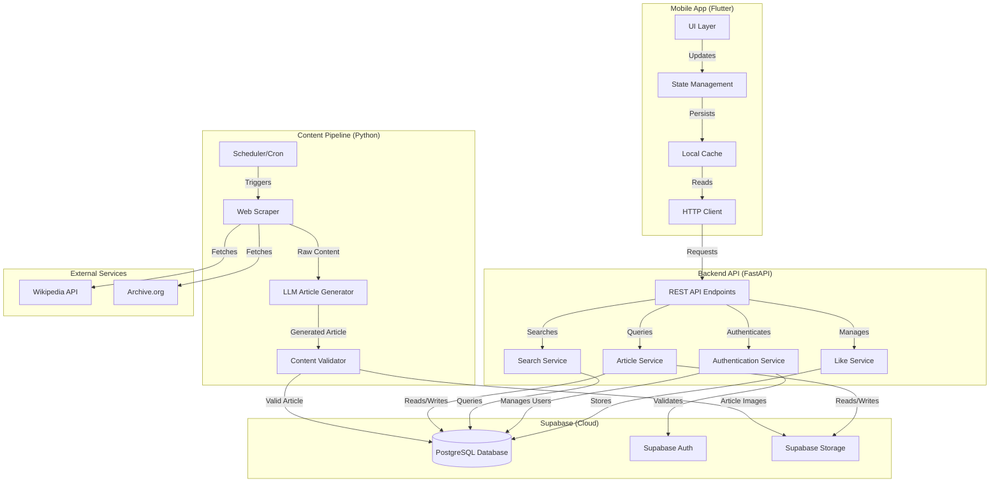

# Design Document: BharatVerse MVP

## Overview

BharatVerse MVP is a mobile-first application that delivers daily curated historical articles about Indian history. The system consists of three main components:

1. **Content Pipeline (Python)**: Scrapes historical content from Wikipedia and archive.org, uses LLM (Anthropic Claude) to generate engaging articles with citations
2. **Backend API (Python/FastAPI)**: Provides REST endpoints for article retrieval, search, user authentication, and likes management, backed by Supabase (PostgreSQL)
3. **Mobile App (Flutter)**: Cross-platform iOS/Android application for browsing and reading articles

The architecture prioritizes simplicity and rapid iteration for MVP validation while maintaining flexibility for future enhancements.

### Design Principles

- **Separation of Concerns**: Content generation, API layer, and mobile UI are independent
- **Async-First**: Python backend uses asyncio for non-blocking operations
- **Stateless API**: REST API is stateless; authentication via Supabase Auth and JWT tokens
- **Offline-First Mobile**: Flutter app caches articles for offline reading
- **Data-Driven**: All content decisions based on structured data models
- **Cloud-Native**: Leverages Supabase for database, authentication, and storage

## Architecture



### Database Choice: Supabase (PostgreSQL)

**For MVP, we're using Supabase** for the following reasons:

**Supabase Advantages for MVP**:
1. **Built-in Authentication**: Supabase Auth handles Google and Facebook OAuth out of the box, eliminating custom auth implementation
2. **PostgreSQL Power**: Full-featured relational database with excellent full-text search, JSON support, and scalability
3. **Auto-generated REST API**: Supabase automatically generates REST endpoints from database schema
4. **Real-time Capabilities**: Built-in real-time subscriptions for future features (comments, notifications)
5. **Supabase Storage**: Integrated file storage for article images and content
6. **Row-Level Security**: Built-in security policies for data access control
7. **Admin Dashboard**: Web-based dashboard for database management and monitoring
8. **Free Tier**: Generous free tier suitable for MVP development and early users
9. **Cloud-Native**: No server management, automatic backups, and scaling
10. **Developer Experience**: Excellent documentation, SDKs for Python and Dart/Flutter

**Supabase Features We'll Use**:
- **PostgreSQL Database**: Store articles, users, likes, search data
- **Supabase Auth**: Handle user registration, login, OAuth (Google, Facebook)
- **Supabase Storage**: Store article images and optional full-text content files
- **Full-Text Search**: PostgreSQL's built-in full-text search with tsvector
- **PostgREST**: Auto-generated REST API (we'll use selectively alongside FastAPI)
- **Row-Level Security (RLS)**: Ensure users can only access their own likes

**Why Supabase Over SQLite**:

SQLite was initially considered but has limitations for a cloud-deployed MVP:
- **No Built-in Auth**: Would require custom OAuth implementation
- **Limited Concurrency**: Single-writer limitation problematic for multi-user apps
- **No Cloud Integration**: Requires custom file storage and backup solutions
- **No Real-time**: Would need custom WebSocket implementation
- **Deployment Complexity**: File-based database harder to manage in cloud environments

**Architecture Benefits**:
- Supabase handles authentication, reducing backend code by ~40%
- Built-in storage eliminates need for separate S3/file storage setup
- PostgreSQL full-text search more powerful than SQLite FTS5
- Real-time subscriptions enable future features without major refactoring
- Admin dashboard provides immediate visibility into data and users

**Cost Considerations**:
- Free tier: 500MB database, 1GB storage, 50,000 monthly active users
- Paid tier: $25/month for 8GB database, 100GB storage, unlimited users
- For MVP, free tier is sufficient; upgrade when approaching limits

This approach follows modern best practices: leverage managed services to focus on core product features rather than infrastructure.

### Technology Stack

**Backend (Python)**:
- FastAPI for REST API
- Supabase Python client for database operations
- PostgreSQL (via Supabase) for structured data
- Pydantic for data validation
- Anthropic Claude API for LLM
- Playwright for web scraping
- LangChain for Wikipedia integration
- python-dotenv for configuration
- asyncpg for async PostgreSQL operations

**Mobile (Flutter/Dart)**:
- Flutter SDK 3.x
- Provider or Riverpod for state management
- supabase_flutter for Supabase integration
- http package for API calls
- shared_preferences for local storage
- sqflite for local database cache
- cached_network_image for image caching
- Supabase Auth for authentication (Google, Facebook OAuth built-in)

**Infrastructure (Supabase)**:
- PostgreSQL database (managed)
- Supabase Auth (OAuth providers)
- Supabase Storage (file storage)
- Row-Level Security policies
- Auto-generated REST API (PostgREST)

## Components and Interfaces

### 1. Content Pipeline Components

#### 1.1 Web Scraper

**Purpose**: Fetch historical content from configured sources

**Interface**:
```python
class WebScraper:
    async def scrape_wikipedia(self, topic: str) -> ScrapedContent
    async def scrape_archive_org(self, url: str) -> ScrapedContent
    async def fetch_images(self, urls: list[str]) -> list[ImageData]
```

**Data Models**:
```python
class ScrapedContent:
    source_url: str
    title: str
    raw_text: str
    images: list[ImageData]
    metadata: dict
    scraped_at: datetime

class ImageData:
    url: str
    alt_text: str
    caption: str | None
```

**Behavior**:
- Respects robots.txt and implements rate limiting (1 request per 2 seconds)
- Retries failed requests with exponential backoff (max 3 attempts)
- Extracts text content, images, and metadata
- Preserves source URLs for citations

#### 1.2 LLM Article Generator

**Purpose**: Transform scraped content into engaging historical articles

**Interface**:
```python
class ArticleGenerator:
    def __init__(self, llm_client: AnthropicClient)
    async def generate_article(self, content: ScrapedContent) -> GeneratedArticle
    async def validate_citations(self, article: GeneratedArticle) -> bool
```

**Data Models**:
```python
class GeneratedArticle:
    title: str
    summary: str
    content: str  # Markdown formatted
    sections: list[Section]
    citations: list[Citation]
    reading_time_minutes: int
    generated_at: datetime

class Section:
    heading: str
    content: str
    order: int

class Citation:
    text: str
    source_url: str
    source_name: str
    accessed_date: datetime
```

**Behavior**:
- Uses Claude API with structured prompts for article generation
- Target reading time: 10-15 minutes (1500-2500 words)
- Generates title, summary, structured sections, and citations
- Validates that citations reference actual source URLs
- Implements retry logic for API failures

**LLM Prompt Structure**:
```
You are a historical content curator specializing in Indian history.

Task: Transform the following scraped content into an engaging 10-15 minute read article.

Requirements:
1. Create a compelling title
2. Write a 2-3 sentence summary
3. Structure content into clear sections with headings
4. Target 1500-2500 words
5. Include proper citations with source URLs
6. Use accessible language suitable for general audiences
7. Focus on factual accuracy and historical context

Scraped Content:
{content}

Output Format: JSON matching GeneratedArticle schema
```

#### 1.3 Content Validator

**Purpose**: Ensure generated articles meet quality standards

**Interface**:
```python
class ContentValidator:
    def validate_article(self, article: GeneratedArticle) -> ValidationResult
    def check_word_count(self, content: str) -> bool
    def check_citations(self, citations: list[Citation]) -> bool
    def check_structure(self, sections: list[Section]) -> bool

class ValidationResult:
    is_valid: bool
    errors: list[str]
    warnings: list[str]
    metrics: dict
```

**Validation Rules**:
- Minimum 1500 words
- At least 1 citation
- Must have introduction, body sections, and conclusion
- All citations must have valid URLs
- Reading time between 10-15 minutes

#### 1.4 Scheduler

**Purpose**: Orchestrate daily article generation

**Interface**:
```python
class ArticleScheduler:
    async def generate_daily_article(self) -> Article
    async def select_topic(self) -> str
    async def check_topic_uniqueness(self, topic: str) -> bool
```

**Behavior**:
- Runs daily via cron job or scheduled task
- Selects topics from curated list or trending Indian history topics
- Checks topic uniqueness against existing articles
- Orchestrates scraping → generation → validation → storage pipeline
- Logs all operations for monitoring

### 2. Backend API Components

#### 2.1 Article Service

**Purpose**: Manage article storage and retrieval using Supabase

**Interface**:
```python
class ArticleService:
    def __init__(self, supabase_client: SupabaseClient)
    async def save_article(self, article: GeneratedArticle) -> Article
    async def get_daily_article(self) -> Article
    async def get_article_by_id(self, article_id: str) -> Article | None
    async def get_article_by_date(self, date: date) -> Article | None
    async def list_articles(self, limit: int, offset: int) -> list[Article]
    async def search_articles(self, query: str) -> list[Article]
```

**Storage Strategy**:
- Article metadata and content stored in Supabase PostgreSQL
- Full article content stored as JSONB column for flexibility
- Article images stored in Supabase Storage
- Database indexes on: date, title, tags, full-text search vectors
- Row-Level Security policies for data access control

#### 2.2 Authentication Service

**Purpose**: Handle user registration, login, and session management using Supabase Auth

**Interface**:
```python
class AuthService:
    def __init__(self, supabase_client: SupabaseClient)
    async def register_user(self, email: str, password: str) -> User
    async def login_user(self, email: str, password: str) -> AuthToken
    async def oauth_login(self, provider: str, access_token: str) -> User
    async def refresh_token(self, refresh_token: str) -> AuthToken
    async def logout_user(self, access_token: str) -> None
    async def get_current_user(self, access_token: str) -> User

class AuthToken:
    access_token: str
    refresh_token: str
    token_type: str
    expires_in: int
    user: User
```

**Authentication Flow**:
1. **Email/Password Registration**:
   - Use Supabase Auth signup method
   - Supabase handles email validation and password hashing
   - Returns JWT tokens automatically
   - User record created in auth.users table

2. **Email/Password Login**:
   - Use Supabase Auth signin method
   - Supabase verifies credentials
   - Returns JWT access token (expires in 1 hour)
   - Returns JWT refresh token (expires in 30 days)

3. **OAuth Flow (Google/Facebook)**:
   - Mobile app initiates OAuth with Supabase Auth
   - Supabase handles OAuth redirect and token exchange
   - User authenticated via Supabase Auth
   - Returns JWT tokens
   - User record automatically created/updated

**JWT Token Structure** (managed by Supabase):
```json
{
  "sub": "user_id",
  "email": "user@example.com",
  "exp": 1234567890,
  "iat": 1234567890,
  "role": "authenticated"
}
```

**Benefits of Supabase Auth**:
- No custom password hashing implementation needed
- OAuth providers configured in Supabase dashboard
- Automatic token refresh handling
- Built-in email verification (optional)
- Session management handled by Supabase

#### 2.3 Search Service

**Purpose**: Enable full-text search across articles using PostgreSQL

**Interface**:
```python
class SearchService:
    def __init__(self, supabase_client: SupabaseClient)
    async def search(self, query: str, filters: SearchFilters) -> SearchResults
    async def autocomplete(self, prefix: str, limit: int = 10) -> list[str]
    async def semantic_search(self, query: str, limit: int = 20) -> list[ArticleSearchResult]
    async def index_article(self, article: Article) -> None
    async def generate_embedding(self, text: str) -> list[float]

class SearchFilters:
    date_from: date | None
    date_to: date | None
    tags: list[str] | None

class SearchResults:
    results: list[ArticleSearchResult]
    total_count: int
    query: str

class ArticleSearchResult:
    article: Article
    relevance_score: float
    matched_snippets: list[str]
```

**Search Methods**:

1. **Full-Text Search** (`search`):
   - Uses PostgreSQL's built-in full-text search with tsvector
   - Returns articles ranked by ts_rank relevance
   - Highlights matching terms in snippets
   - More powerful than SQLite FTS5 with better ranking

2. **Autocomplete** (`autocomplete`):
   - Queries `search_suggestions` table with prefix matching
   - Uses PostgreSQL LIKE or trigram similarity (pg_trgm extension)
   - Returns top suggestions ordered by frequency
   - Example: `autocomplete("maur")` → `["Mauryan Empire", "Mauryan Dynasty", "Mauryan Architecture"]`

3. **Semantic Search** (`semantic_search`):
   - Generates embedding for query using LLM
   - Uses PostgreSQL pgvector extension for vector similarity
   - Computes cosine similarity with article embeddings
   - Returns semantically similar articles
   - Example: Query "ancient rulers" finds articles about "emperors", "kings", "dynasties"

**Indexing Process**:
When a new article is added:
1. Add to PostgreSQL with automatic tsvector generation (via trigger)
2. Extract search terms (title words, tags, entities) → add to `search_suggestions`
3. Generate embedding (optional) → store in `article_embeddings` using pgvector

**Search Implementation**:

The search system uses PostgreSQL's powerful full-text search capabilities:

1. **Full-Text Search (PostgreSQL tsvector)**:
   - Primary search mechanism using ts_rank ranking algorithm
   - Search fields: title, content, tags
   - Supports prefix matching and phrase queries
   - Better performance and ranking than SQLite FTS5
   - Automatic stemming and stop word handling

2. **Autocomplete Suggestions**:
   - Pre-computed search suggestions stored in `search_suggestions` table
   - Populated from article titles, tags, person names, event names, and historical periods
   - Prefix-based matching using PostgreSQL LIKE or pg_trgm extension
   - Updated automatically when new articles are added
   - Example: User types "maur" → suggests ["Mauryan Empire", "Mauryan Dynasty", "Mauryan Architecture"]

3. **Semantic Similarity Search (Optional)**:
   - Article embeddings stored using pgvector extension
   - Enables semantic search: "emperor" finds articles about "kings", "rulers", "monarchs"
   - Computed on-demand: query embedding → cosine similarity with article embeddings
   - Fallback to tsvector search if embeddings not available

**Search Flow**:
```
User Query → Autocomplete Suggestions (instant)
          ↓
User Submits → PostgreSQL Full-Text Search (primary results)
          ↓
          → Semantic Search with pgvector (enhanced results, optional)
          ↓
          → Merge & Rank Results → Return to User
```

**Performance**:
- Autocomplete: < 50ms (indexed prefix search)
- Full-Text Search: < 200ms (tsvector search with GIN index)
- Semantic Search: < 500ms (pgvector similarity computation)

**Highlight matching terms in results**

#### 2.4 Like Service

**Purpose**: Track user article likes for future personalization

**Interface**:
```python
class LikeService:
    def __init__(self, supabase_client: SupabaseClient)
    async def like_article(self, user_id: str, article_id: str) -> None
    async def unlike_article(self, user_id: str, article_id: str) -> None
    async def is_liked(self, user_id: str, article_id: str) -> bool
    async def get_user_likes(self, user_id: str) -> list[Article]
    async def get_article_like_count(self, article_id: str) -> int
```

**Data Model**:
```python
class Like:
    id: str
    user_id: str
    article_id: str
    created_at: datetime
```

**Storage**:
- Stored in Supabase PostgreSQL with composite unique constraint on (user_id, article_id)
- Row-Level Security policy ensures users can only manage their own likes
- Enables efficient queries for user likes and article like counts
- Foreign key constraints ensure referential integrity

#### 2.5 REST API Endpoints

**Article Endpoints**:
```
GET  /api/v1/articles/daily              - Get today's daily article
GET  /api/v1/articles/{id}               - Get article by ID
GET  /api/v1/articles                    - List articles (paginated)
GET  /api/v1/articles/search?q=...       - Search articles (FTS5)
GET  /api/v1/articles/search/autocomplete?q=... - Get autocomplete suggestions
GET  /api/v1/articles/search/semantic?q=... - Semantic similarity search (optional)
```

**Authentication Endpoints**:
```
POST /api/v1/auth/register           - Register with email/password
POST /api/v1/auth/login              - Login with email/password
POST /api/v1/auth/oauth/google       - OAuth login with Google
POST /api/v1/auth/oauth/facebook     - OAuth login with Facebook
POST /api/v1/auth/refresh            - Refresh access token
POST /api/v1/auth/logout             - Logout user
```

**Like Endpoints** (Authenticated):
```
POST   /api/v1/articles/{id}/like    - Like an article
DELETE /api/v1/articles/{id}/like    - Unlike an article
GET    /api/v1/users/me/likes        - Get user's liked articles
```

**Request/Response Examples**:

```json
// GET /api/v1/articles/daily
{
  "id": "art_20250228_001",
  "title": "The Mauryan Empire: India's First Great Dynasty",
  "summary": "Explore the rise and fall of the Mauryan Empire...",
  "date": "2025-02-28",
  "reading_time_minutes": 12,
  "author": "BharatVerse AI",
  "tags": ["ancient-india", "mauryan-empire", "chandragupta"],
  "content_url": "/api/v1/articles/art_20250228_001/content",
  "image_url": "https://example.com/images/mauryan.jpg",
  "is_liked": false
}

// POST /api/v1/auth/register
Request:
{
  "email": "user@example.com",
  "password": "SecurePass123!"
}

Response:
{
  "user": {
    "id": "usr_123",
    "email": "user@example.com",
    "created_at": "2025-02-28T10:00:00Z"
  },
  "tokens": {
    "access_token": "eyJ...",
    "refresh_token": "eyJ...",
    "token_type": "Bearer",
    "expires_in": 3600
  }
}
```

### 3. Mobile App Components

#### 3.1 State Management

**Architecture**: Provider pattern with ChangeNotifier

**State Classes**:
```dart
class ArticleState extends ChangeNotifier {
  Article? dailyArticle;
  List<Article> articles = [];
  bool isLoading = false;
  String? error;
  
  Future<void> fetchDailyArticle();
  Future<void> fetchArticles({int page = 0});
  Future<void> searchArticles(String query);
}

class AuthState extends ChangeNotifier {
  User? currentUser;
  bool isAuthenticated = false;
  String? authToken;
  
  Future<void> register(String email, String password);
  Future<void> login(String email, String password);
  Future<void> loginWithGoogle();
  Future<void> loginWithFacebook();
  Future<void> logout();
}

class LikeState extends ChangeNotifier {
  Set<String> likedArticleIds = {};
  
  Future<void> toggleLike(String articleId);
  Future<void> fetchUserLikes();
  bool isLiked(String articleId);
}
```

#### 3.2 UI Components

**Screen Structure**:
```
HomeScreen
├── DailyArticleCard (featured)
├── ArticleListView (past articles)
└── BottomNavigationBar

ArticleDetailScreen
├── ArticleHeader (title, date, reading time)
├── ArticleContent (markdown rendered)
├── CitationsSection
└── LikeButton

SearchScreen
├── SearchBar
├── SearchFilters
└── SearchResultsList

AuthScreen
├── EmailLoginForm
├── OAuthButtons (Google, Facebook)
└── RegisterLink

ProfileScreen (future)
└── LikedArticlesList
```

**Key Widgets**:
```dart
class DailyArticleCard extends StatelessWidget {
  final Article article;
  // Displays featured daily article with image, title, summary
}

class ArticleListTile extends StatelessWidget {
  final Article article;
  // Compact article display for lists
}

class ArticleContentView extends StatelessWidget {
  final String markdownContent;
  // Renders markdown with proper typography
}

class LikeButton extends StatefulWidget {
  final String articleId;
  final bool isLiked;
  final VoidCallback onToggle;
  // Animated like button with heart icon
}
```

#### 3.3 Data Layer

**API Client**:
```dart
class ApiClient {
  final String baseUrl;
  final SupabaseClient supabaseClient;
  
  Future<Article> getDailyArticle();
  Future<Article> getArticle(String id);
  Future<List<Article>> listArticles({int page = 0, int limit = 20});
  Future<List<Article>> searchArticles(String query);
  Future<List<String>> getAutocompleteSuggestions(String prefix);
  Future<List<Article>> semanticSearch(String query);
  
  Future<AuthResponse> register(String email, String password);
  Future<AuthResponse> login(String email, String password);
  Future<AuthResponse> signInWithGoogle();
  Future<AuthResponse> signInWithFacebook();
  Future<void> signOut();
  
  Future<void> likeArticle(String articleId);
  Future<void> unlikeArticle(String articleId);
  Future<List<Article>> getUserLikes();
}
```

**Local Cache**:
```dart
class ArticleCache {
  final Database db;
  
  Future<void> cacheArticle(Article article);
  Future<Article?> getCachedArticle(String id);
  Future<List<Article>> getCachedArticles();
  Future<void> clearOldCache({int daysToKeep = 7});
}

class SecureStorage {
  Future<void> saveAuthToken(String token);
  Future<String?> getAuthToken();
  Future<void> deleteAuthToken();
}
```

## Data Models

### Core Data Models

**Article** (Shared across backend and mobile):
```python
class Article(BaseModel):
    id: str  # Format: art_YYYYMMDD_NNN
    title: str
    summary: str  # 2-3 sentences
    content: str  # Markdown formatted
    sections: list[Section]
    citations: list[Citation]
    date: date  # Publication date
    reading_time_minutes: int
    author: str  # "BharatVerse AI"
    tags: list[str]  # e.g., ["ancient-india", "mauryan-empire"]
    image_url: str | None
    created_at: datetime
    updated_at: datetime
```

**User**:
```python
class User(BaseModel):
    id: str  # Format: usr_XXXXX
    email: str
    password_hash: str | None  # None for OAuth-only users
    oauth_provider: str | None  # "google", "facebook", or None
    oauth_id: str | None
    created_at: datetime
    last_login: datetime
```

**Like**:
```python
class Like(BaseModel):
    id: str
    user_id: str
    article_id: str
    created_at: datetime
```

### Database Schema

**PostgreSQL Tables (Supabase)**:

```sql
-- Articles table with full-text search
CREATE TABLE articles (
    id TEXT PRIMARY KEY,
    title TEXT NOT NULL,
    summary TEXT NOT NULL,
    content JSONB NOT NULL,  -- Full article content as JSONB
    sections JSONB NOT NULL,  -- Array of sections
    citations JSONB NOT NULL,  -- Array of citations
    date DATE NOT NULL,
    reading_time_minutes INTEGER NOT NULL,
    author TEXT NOT NULL,
    tags TEXT[] NOT NULL,  -- PostgreSQL array type
    image_url TEXT,
    created_at TIMESTAMPTZ NOT NULL DEFAULT NOW(),
    updated_at TIMESTAMPTZ NOT NULL DEFAULT NOW(),
    search_vector tsvector  -- Full-text search vector
);

-- Indexes for performance
CREATE INDEX idx_articles_date ON articles(date DESC);
CREATE INDEX idx_articles_tags ON articles USING GIN(tags);
CREATE INDEX idx_articles_search ON articles USING GIN(search_vector);

-- Trigger to automatically update search_vector
CREATE TRIGGER articles_search_vector_update
BEFORE INSERT OR UPDATE ON articles
FOR EACH ROW EXECUTE FUNCTION
tsvector_update_trigger(search_vector, 'pg_catalog.english', title, content);

-- Users table (managed by Supabase Auth, but we can extend it)
CREATE TABLE user_profiles (
    id UUID PRIMARY KEY REFERENCES auth.users(id) ON DELETE CASCADE,
    email TEXT NOT NULL,
    created_at TIMESTAMPTZ NOT NULL DEFAULT NOW(),
    last_login TIMESTAMPTZ NOT NULL DEFAULT NOW()
);

-- Likes table with Row-Level Security
CREATE TABLE likes (
    id UUID PRIMARY KEY DEFAULT gen_random_uuid(),
    user_id UUID NOT NULL REFERENCES auth.users(id) ON DELETE CASCADE,
    article_id TEXT NOT NULL REFERENCES articles(id) ON DELETE CASCADE,
    created_at TIMESTAMPTZ NOT NULL DEFAULT NOW(),
    UNIQUE(user_id, article_id)
);

CREATE INDEX idx_likes_user ON likes(user_id);
CREATE INDEX idx_likes_article ON likes(article_id);

-- Row-Level Security for likes
ALTER TABLE likes ENABLE ROW LEVEL SECURITY;

CREATE POLICY "Users can view their own likes"
ON likes FOR SELECT
USING (auth.uid() = user_id);

CREATE POLICY "Users can insert their own likes"
ON likes FOR INSERT
WITH CHECK (auth.uid() = user_id);

CREATE POLICY "Users can delete their own likes"
ON likes FOR DELETE
USING (auth.uid() = user_id);

-- Search suggestions for autocomplete
CREATE TABLE search_suggestions (
    id UUID PRIMARY KEY DEFAULT gen_random_uuid(),
    term TEXT NOT NULL,
    category TEXT NOT NULL,  -- 'title', 'tag', 'person', 'event', 'period'
    frequency INTEGER DEFAULT 1,
    article_count INTEGER DEFAULT 0,
    created_at TIMESTAMPTZ NOT NULL DEFAULT NOW(),
    updated_at TIMESTAMPTZ NOT NULL DEFAULT NOW()
);

CREATE INDEX idx_search_suggestions_term ON search_suggestions(term);
CREATE INDEX idx_search_suggestions_category ON search_suggestions(category);
CREATE INDEX idx_search_suggestions_frequency ON search_suggestions(frequency DESC);

-- Article embeddings for semantic search (optional, requires pgvector extension)
CREATE EXTENSION IF NOT EXISTS vector;

CREATE TABLE article_embeddings (
    article_id TEXT PRIMARY KEY REFERENCES articles(id) ON DELETE CASCADE,
    embedding vector(1536),  -- OpenAI ada-002 dimension, adjust as needed
    model TEXT NOT NULL,  -- 'text-embedding-ada-002' or 'claude-3-embedding'
    created_at TIMESTAMPTZ NOT NULL DEFAULT NOW()
);

CREATE INDEX idx_embeddings_vector ON article_embeddings 
USING ivfflat (embedding vector_cosine_ops);
```

**Supabase Storage Buckets**:

```sql
-- Create storage bucket for article images
INSERT INTO storage.buckets (id, name, public)
VALUES ('article-images', 'article-images', true);

-- Storage policy for article images (public read)
CREATE POLICY "Public read access for article images"
ON storage.objects FOR SELECT
USING (bucket_id = 'article-images');

-- Storage policy for article images (authenticated write)
CREATE POLICY "Authenticated users can upload article images"
ON storage.objects FOR INSERT
WITH CHECK (bucket_id = 'article-images' AND auth.role() = 'authenticated');
```

## Correctness Properties

*A property is a characteristic or behavior that should hold true across all valid executions of a system—essentially, a formal statement about what the system should do. Properties serve as the bridge between human-readable specifications and machine-verifiable correctness guarantees.*


### Content Pipeline Properties

**Property 1: Scraping completeness**
*For any* scraping job on a valid source URL, the scraped content should contain text content, source URL, and metadata (images may be optional depending on source).
**Validates: Requirements 1.1, 1.2, 1.3**

**Property 2: Scraping resilience**
*For any* list of source URLs where some are unavailable, the scraper should successfully process available sources and log errors for unavailable ones without failing the entire job.
**Validates: Requirements 1.4**

**Property 3: Article generation completeness**
*For any* valid scraped content, the generated article should contain a title, summary, structured sections, at least one citation with source URL, and reading time between 10-15 minutes.
**Validates: Requirements 2.1, 2.2, 2.3, 2.4**

**Property 4: Retry with exponential backoff**
*For any* failed article generation attempt, the system should retry with exponentially increasing delays (e.g., 1s, 2s, 4s) up to a maximum number of attempts.
**Validates: Requirements 2.6**

### Storage and Retrieval Properties

**Property 5: Article persistence round-trip**
*For any* valid generated article, storing it and then retrieving it by ID should return an equivalent article with all fields preserved.
**Validates: Requirements 3.1, 3.3**

**Property 6: Query method completeness**
*For any* stored article, it should be retrievable by its ID, by its publication date, and should appear in paginated list queries.
**Validates: Requirements 3.2**

**Property 7: Date-based ordering**
*For any* set of articles with different publication dates, querying all articles should return them ordered by publication date (newest first).
**Validates: Requirements 3.4**

**Property 8: Storage validation**
*For any* article missing required fields (title, content, date, etc.), attempting to store it should fail with a validation error.
**Validates: Requirements 3.5**

### Daily Article Properties

**Property 9: One daily article per day**
*For any* calendar date, there should be exactly one article designated as the daily article for that date.
**Validates: Requirements 4.1**

**Property 10: Daily article updates with date**
*For any* two consecutive calendar dates, the daily article for date N should be different from the daily article for date N+1.
**Validates: Requirements 4.3**

**Property 11: Topic uniqueness**
*For any* new article topic, if an article with the same topic already exists in the database, the new article should not be published unless it's marked as containing substantially new information.
**Validates: Requirements 4.4**

### Search Properties

**Property 12: Search result relevance**
*For any* search query and article, if the article's title or content contains the query terms, it should appear in the search results.
**Validates: Requirements 7.2**

**Property 13: Search result ordering**
*For any* search query with multiple matching articles, results should be ordered by relevance score in descending order.
**Validates: Requirements 7.3**

**Property 14: Multi-field search**
*For any* search query, the system should find matches in article titles, content, tags, and metadata fields (person names, event names, periods).
**Validates: Requirements 7.6**

### Offline Cache Properties

**Property 15: View-triggered caching**
*For any* article viewed by a user, the article should be stored in the local cache immediately after viewing.
**Validates: Requirements 8.1**

**Property 16: Offline article access**
*For any* cached article, when the device is offline, the article should be retrievable from the cache with all content intact.
**Validates: Requirements 8.2**

**Property 17: Minimum cache retention**
*For any* point in time, the cache should contain at least the last 7 days of viewed articles (or all articles if fewer than 7 days exist).
**Validates: Requirements 8.3**

**Property 18: LRU cache eviction**
*For any* cache at capacity, when a new article is cached, the oldest article by view date should be evicted first.
**Validates: Requirements 8.4**

**Property 19: Cache synchronization**
*For any* cached article, when online and the article has been updated on the server, fetching the article should update the cached version.
**Validates: Requirements 8.5**

### API Properties

**Property 20: Pagination consistency**
*For any* paginated article list request, the union of all pages should equal the complete article set, with no duplicates or missing articles.
**Validates: Requirements 9.3**

**Property 21: API response format**
*For any* successful API request, the response should be valid JSON with appropriate HTTP status code (200, 201, etc.), and for any failed request, the response should include an error message with appropriate error status code (400, 404, 500, etc.).
**Validates: Requirements 9.5, 9.6**

### Validation Properties

**Property 22: Article quality validation**
*For any* generated article, it should pass validation if and only if it contains at least 1500 words, at least one citation, and properly formatted sections (introduction, body, conclusion).
**Validates: Requirements 10.1, 10.2, 10.3**

**Property 23: Validation rejection**
*For any* article that fails quality validation, attempting to store it should be rejected and validation errors should be logged.
**Validates: Requirements 10.4**

**Property 24: Metrics tracking**
*For any* generated article, the system should record quality metrics including word count, citation count, and generation time.
**Validates: Requirements 10.5**

### Logging Properties

**Property 25: Error logging completeness**
*For any* error occurring in the content pipeline or API, a log entry should be created containing timestamp, error context, and stack trace.
**Validates: Requirements 11.1, 11.3**

**Property 26: Log level structure**
*For any* log entry, it should have a severity level (DEBUG, INFO, WARNING, ERROR) and follow a consistent structured format.
**Validates: Requirements 11.4**

### Authentication Properties

**Property 27: Email validation**
*For any* registration attempt with email and password, the system should reject invalid email formats and weak passwords (less than 8 characters, no special characters).
**Validates: Requirements 12.4**

**Property 28: Session creation**
*For any* successful login (email/password or OAuth), the system should create an authenticated session with a valid JWT token.
**Validates: Requirements 12.5**

**Property 29: Password security**
*For any* user registered with email/password, the stored password should be hashed (not plaintext) using bcrypt or equivalent.
**Validates: Requirements 12.6**

**Property 30: Logout session termination**
*For any* authenticated user who logs out, subsequent API requests with their previous token should be rejected as unauthorized.
**Validates: Requirements 12.7**

### Like Properties

**Property 31: Like toggle behavior**
*For any* article and authenticated user, liking an unliked article should create a like record, and liking an already-liked article should remove the like record (toggle).
**Validates: Requirements 13.2, 13.3**

**Property 32: Like persistence**
*For any* article liked by a user, the like should persist across app restarts and be retrievable via the user's liked articles API.
**Validates: Requirements 13.5, 13.6**

### Search Properties (Enhanced)

**Property 33: Autocomplete prefix matching**
*For any* search prefix entered by a user, the autocomplete system should return suggestions that start with that prefix, ordered by frequency/relevance.
**Validates: Requirements 7.1**

**Property 34: Autocomplete performance**
*For any* autocomplete query, the system should return suggestions within 50ms.
**Validates: Requirements 7.1**

**Property 35: Semantic search similarity**
*For any* semantic search query, articles returned should be semantically related to the query even if they don't contain exact keyword matches.
**Validates: Requirements 7.2, 7.6**

**Property 36: Search suggestion updates**
*For any* newly added article, search suggestions should be automatically extracted and added to the suggestions table.
**Validates: Requirements 7.1**

## Search Implementation Details

### Autocomplete Implementation

**Suggestion Extraction Process**:
When a new article is indexed, the system extracts searchable terms:

```python
async def extract_search_suggestions(article: Article) -> list[SearchSuggestion]:
    suggestions = []
    
    # Extract from title (split into meaningful phrases)
    title_terms = extract_phrases(article.title)
    for term in title_terms:
        suggestions.append(SearchSuggestion(
            term=term,
            category='title',
            frequency=1
        ))
    
    # Extract from tags
    for tag in article.tags:
        suggestions.append(SearchSuggestion(
            term=tag.replace('-', ' ').title(),
            category='tag',
            frequency=1
        ))
    
    # Extract named entities (persons, events, periods) using NER
    entities = extract_entities(article.content)
    for entity in entities:
        suggestions.append(SearchSuggestion(
            term=entity.text,
            category=entity.type,  # 'person', 'event', 'period'
            frequency=1
        ))
    
    return suggestions
```

**Autocomplete Query**:
```python
async def autocomplete(prefix: str, limit: int = 10) -> list[str]:
    query = """
        SELECT DISTINCT term 
        FROM search_suggestions 
        WHERE term LIKE ? || '%'
        ORDER BY frequency DESC, article_count DESC
        LIMIT ?
    """
    results = await db.execute(query, (prefix.lower(), limit))
    return [row['term'] for row in results]
```

**Example Autocomplete Flow**:
```
User types: "maur"
↓
Query: SELECT term FROM search_suggestions WHERE term LIKE 'maur%'
↓
Results: ["Mauryan Empire", "Mauryan Dynasty", "Mauryan Architecture", "Mauryan Art"]
↓
Display suggestions to user in real-time
```

### Semantic Search Implementation

**Embedding Generation**:
```python
async def generate_embedding(text: str) -> list[float]:
    """Generate embedding using Claude or OpenAI API"""
    # Option 1: Use Claude (if available)
    response = await anthropic_client.embeddings.create(
        model="claude-3-embedding",
        input=text
    )
    return response.embedding
    
    # Option 2: Use OpenAI (fallback)
    response = await openai_client.embeddings.create(
        model="text-embedding-ada-002",
        input=text
    )
    return response.data[0].embedding
```

**Semantic Search with pgvector**:
```python
async def semantic_search(query: str, limit: int = 20) -> list[ArticleSearchResult]:
    """Use PostgreSQL pgvector extension for efficient vector similarity search"""
    # Generate query embedding
    query_embedding = await generate_embedding(query)
    
    # Use pgvector's cosine similarity operator (<=>)
    # This is much faster than computing similarity in Python
    query = """
        SELECT 
            a.id, a.title, a.summary, a.content,
            (e.embedding <=> $1::vector) as distance
        FROM articles a
        JOIN article_embeddings e ON a.id = e.article_id
        ORDER BY e.embedding <=> $1::vector
        LIMIT $2
    """
    
    results = await supabase.rpc(
        'semantic_search',
        {
            'query_embedding': query_embedding,
            'match_count': limit
        }
    )
    
    # Convert distance to similarity score (1 - distance for cosine)
    articles = []
    for row in results:
        article = Article(**row)
        article.relevance_score = 1 - row['distance']
        articles.append(article)
    
    return articles
```

**Hybrid Search Strategy**:
```python
async def hybrid_search(query: str) -> SearchResults:
    """Combine PostgreSQL full-text search and pgvector semantic search"""
    
    # 1. PostgreSQL full-text search (fast, exact matches)
    fts_results = await fulltext_search(query, limit=15)
    
    # 2. Semantic search with pgvector (slower, semantic matches)
    semantic_results = await semantic_search(query, limit=10)
    
    # 3. Merge and deduplicate
    seen_ids = set()
    merged_results = []
    
    # Prioritize full-text results (exact matches)
    for result in fts_results:
        if result.article.id not in seen_ids:
            merged_results.append(result)
            seen_ids.add(result.article.id)
    
    # Add semantic results (semantic matches)
    for result in semantic_results:
        if result.article.id not in seen_ids:
            merged_results.append(result)
            seen_ids.add(result.article.id)
    
    return SearchResults(
        results=merged_results[:20],
        total_count=len(merged_results),
        query=query
    )
```

**Example Semantic Search**:
```
User query: "ancient rulers of India"
↓
Generate embedding for query
↓
pgvector computes cosine similarity with article embeddings (using IVFFlat index)
↓
Results include articles about:
- "Mauryan Empire" (contains "Chandragupta Maurya")
- "Gupta Dynasty" (contains "Samudragupta")
- "Mughal Emperors" (contains "Akbar", "Shah Jahan")
- "Chola Kings" (contains "Raja Raja Chola")
↓
Even though articles don't contain exact phrase "ancient rulers"
```

### Search Performance Optimization

**Caching Strategy**:
- Cache popular search queries and their results (TTL: 1 hour)
- Cache autocomplete suggestions for common prefixes
- Pre-compute embeddings during article indexing (not on-demand)

**Indexing Strategy**:
- Update search suggestions asynchronously after article creation
- Generate embeddings in background job (not blocking article creation)
- PostgreSQL automatically updates tsvector via trigger

**Scaling Considerations**:
- For MVP: pgvector with IVFFlat index (excellent for < 100,000 articles)
- pgvector is much faster than in-memory Python cosine similarity
- Post-MVP: Tune IVFFlat parameters (lists, probes) for optimal performance
- Future: Consider HNSW index in pgvector for even better performance

**pgvector Benefits**:
- Native PostgreSQL extension, no separate service needed
- Efficient approximate nearest neighbor (ANN) search
- Supports multiple distance metrics (cosine, L2, inner product)
- Integrates seamlessly with existing PostgreSQL queries
- Much faster than computing similarity in application code

## Error Handling

### Content Pipeline Errors

**Scraping Errors**:
- Network timeouts: Retry with exponential backoff (max 3 attempts)
- Invalid HTML/content: Log error, skip source, continue with other sources
- Rate limit exceeded: Wait and retry after delay period
- robots.txt violation: Skip source, log warning

**LLM Generation Errors**:
- API timeout: Retry with exponential backoff (max 3 attempts)
- Invalid response format: Log error, retry with modified prompt
- Rate limit exceeded: Queue for later processing
- Content policy violation: Log error, mark topic as problematic

**Validation Errors**:
- Word count too low: Reject article, log metrics, retry generation with "expand content" instruction
- Missing citations: Reject article, retry generation with "include citations" instruction
- Malformed structure: Reject article, retry generation with structure template

### API Errors

**Client Errors (4xx)**:
- 400 Bad Request: Invalid request format or parameters
- 401 Unauthorized: Missing or invalid authentication token
- 403 Forbidden: Valid token but insufficient permissions
- 404 Not Found: Requested resource doesn't exist
- 429 Too Many Requests: Rate limit exceeded

**Server Errors (5xx)**:
- 500 Internal Server Error: Unexpected server error
- 503 Service Unavailable: Server overloaded or maintenance

**Error Response Format**:
```json
{
  "error": {
    "code": "ARTICLE_NOT_FOUND",
    "message": "Article with ID 'art_20250228_001' not found",
    "details": {
      "article_id": "art_20250228_001"
    }
  }
}
```

### Mobile App Errors

**Network Errors**:
- No internet connection: Display cached content, show offline indicator
- Request timeout: Retry with exponential backoff, show loading indicator
- Server error: Display user-friendly error message, offer retry

**Authentication Errors**:
- Invalid credentials: Display error message, allow retry
- Expired token: Automatically refresh token, retry request
- OAuth failure: Display provider-specific error, offer alternative login methods

**Cache Errors**:
- Cache full: Evict oldest articles, log warning
- Corrupted cache: Clear cache, re-fetch articles
- Database error: Fallback to in-memory cache, log error

## Testing Strategy

### Dual Testing Approach

The BharatVerse MVP will employ both unit testing and property-based testing to ensure comprehensive coverage:

**Unit Tests**: Focus on specific examples, edge cases, and integration points
- Test specific scraping scenarios (Wikipedia page, archive.org page)
- Test authentication flows (email/password, Google OAuth, Facebook OAuth)
- Test API endpoints with known inputs and expected outputs
- Test UI components with specific article data
- Test error handling with simulated failures

**Property-Based Tests**: Verify universal properties across all inputs
- Test scraping with randomly generated URLs and content
- Test article generation with random scraped content
- Test storage and retrieval with random article data
- Test search with random queries and article sets
- Test cache behavior with random article sequences
- Test authentication with random credentials
- Test like toggle with random user/article combinations

### Property-Based Testing Configuration

**Framework**: 
- Python backend: `hypothesis` library
- Flutter mobile: `test` package with custom property test helpers

**Configuration**:
- Minimum 100 iterations per property test
- Each test tagged with feature name and property number
- Tag format: `# Feature: bharatverse-mvp, Property {N}: {property_text}`

**Example Property Test (Python)**:
```python
from hypothesis import given, strategies as st
import pytest

@given(
    article=st.builds(
        Article,
        title=st.text(min_size=10, max_size=200),
        content=st.text(min_size=1500, max_size=5000),
        citations=st.lists(st.builds(Citation), min_size=1)
    )
)
@pytest.mark.property_test
def test_article_persistence_round_trip(article):
    """
    Feature: bharatverse-mvp, Property 5: Article persistence round-trip
    For any valid generated article, storing it and then retrieving it by ID
    should return an equivalent article with all fields preserved.
    """
    # Store article
    stored_id = article_service.save_article(article)
    
    # Retrieve article
    retrieved = article_service.get_article_by_id(stored_id)
    
    # Assert equivalence
    assert retrieved is not None
    assert retrieved.title == article.title
    assert retrieved.content == article.content
    assert len(retrieved.citations) == len(article.citations)
```

**Example Property Test (Dart/Flutter)**:
```dart
import 'package:test/test.dart';

void main() {
  group('Property Tests', () {
    test('Like toggle behavior', () async {
      // Feature: bharatverse-mvp, Property 31: Like toggle behavior
      // For any article and authenticated user, liking an unliked article
      // should create a like record, and liking an already-liked article
      // should remove the like record (toggle).
      
      for (int i = 0; i < 100; i++) {
        final userId = generateRandomUserId();
        final articleId = generateRandomArticleId();
        
        // Initially not liked
        expect(await likeService.isLiked(userId, articleId), false);
        
        // Like article
        await likeService.likeArticle(userId, articleId);
        expect(await likeService.isLiked(userId, articleId), true);
        
        // Unlike article (toggle)
        await likeService.likeArticle(userId, articleId);
        expect(await likeService.isLiked(userId, articleId), false);
      }
    });
  });
}
```

### Test Coverage Goals

- **Backend**: 80% code coverage minimum
- **Mobile**: 70% code coverage minimum (UI testing is harder)
- **Property Tests**: All 32 correctness properties implemented
- **Integration Tests**: End-to-end flows (scraping → storage → API → mobile)

### Testing Pyramid

```
        /\
       /  \
      / E2E \          10% - End-to-end tests
     /______\
    /        \
   /Integration\       20% - Integration tests
  /____________\
 /              \
/  Unit + Props  \     70% - Unit and property tests
/__________________\
```

## Deployment Architecture

### MVP Deployment with Supabase

For MVP, we leverage Supabase's managed infrastructure:

**Backend**:
- Single Python server (FastAPI) running on a VPS or cloud instance (Railway, Render, or DigitalOcean)
- Supabase PostgreSQL database (managed, no server setup needed)
- Supabase Storage for article images
- Supabase Auth for user authentication
- Scheduled cron job for daily article generation (using cron or cloud scheduler)

**Mobile**:
- Flutter apps published to Google Play Store and Apple App Store
- Apps connect to FastAPI backend and Supabase directly
- Supabase Flutter SDK handles auth and real-time features

**Infrastructure**:
- Domain with SSL certificate (Let's Encrypt or cloud provider)
- Nginx as reverse proxy (optional, many platforms provide this)
- Supabase dashboard for database management
- Basic monitoring via Supabase and application logs

**Supabase Configuration**:
- Project created in Supabase dashboard
- Database schema deployed via migrations
- Row-Level Security policies configured
- OAuth providers (Google, Facebook) configured in Supabase Auth
- Storage buckets created for article images
- API keys and connection strings stored in environment variables

### Future Scalability Considerations

Supabase provides excellent scalability out of the box:

- **Database**: Supabase PostgreSQL scales vertically (upgrade plan) and horizontally (read replicas)
- **File Storage**: Supabase Storage scales automatically with usage
- **API**: Single FastAPI server → Load-balanced multiple instances
- **Cache**: In-app cache → Redis for shared caching (Supabase compatible)
- **Search**: PostgreSQL full-text → Keep PostgreSQL or add Meilisearch
- **Queue**: Direct execution → Celery/RabbitMQ for async tasks
- **Real-time**: Supabase real-time already available for future features

## Security Considerations

### Authentication Security

- Passwords hashed by Supabase Auth (bcrypt with appropriate cost factor)
- JWT tokens managed by Supabase with short expiration (1 hour access, 30 days refresh)
- Secure token storage on mobile via Supabase Flutter SDK
- OAuth tokens validated by Supabase Auth with provider APIs
- HTTPS only for all API communication (enforced by Supabase)
- Row-Level Security policies enforce data access control

### Data Security

- User data encrypted at rest by Supabase (AES-256)
- API rate limiting to prevent abuse (Supabase + FastAPI)
- Input validation on all endpoints
- SQL injection prevention (parameterized queries via Supabase client)
- XSS prevention (content sanitization)
- Row-Level Security ensures users can only access their own data

### Privacy

- Minimal data collection (email, likes only)
- No tracking or analytics in MVP
- User data deletion on account deletion (CASCADE constraints)
- Compliance with basic privacy standards
- Supabase is SOC 2 Type 2 compliant

## Performance Considerations

### Backend Performance

- Article generation: Max 5 minutes per article (acceptable for daily batch)
- API response time: Target < 500ms for article retrieval
- Database queries: Indexed for common queries (date, ID, search)
- Rate limiting: 100 requests per minute per IP

### Mobile Performance

- App launch time: Target < 2 seconds
- Article load time: Target < 1 second (cached) or < 3 seconds (network)
- Smooth scrolling: 60 FPS target
- Image loading: Progressive loading with placeholders
- Cache size: Max 100MB (configurable)

### Optimization Strategies

- Lazy loading for article lists
- Image compression and caching
- Pagination for large result sets
- Database query optimization
- Async operations for non-blocking UI

## Monitoring and Observability

### Logging

- Structured JSON logs
- Log levels: DEBUG, INFO, WARNING, ERROR, CRITICAL
- Log rotation (daily, max 30 days retention)
- Centralized logging (future: ELK stack or similar)

### Metrics

- Article generation success rate
- API response times
- Error rates by endpoint
- User registration and login rates
- Article view counts
- Like counts per article

### Alerts

- Critical errors in content pipeline
- API downtime or high error rates
- Database connection failures
- Disk space warnings

## Future Enhancements (Post-MVP)

While out of scope for MVP, the design accommodates these future features:

1. **Multilingual Support**: Add translation service, language detection
2. **Push Notifications**: Integrate FCM/APNS for daily article notifications
3. **Recommendations**: Use like data for personalized article suggestions
4. **Social Features**: Add comments, sharing, user profiles
5. **Subscription System**: Integrate payment gateway, premium content
6. **Content Management**: Admin UI for manual curation and editing
7. **Analytics Dashboard**: User engagement metrics, content performance
8. **Advanced Search**: Filters, facets, autocomplete
9. **Reading History**: Track and display user reading progress
10. **Bookmarks**: Save articles for later reading
